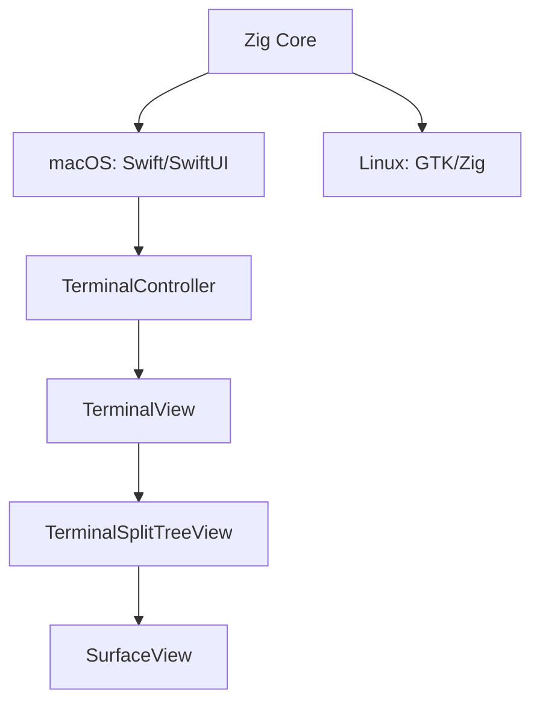

# Git Worktree Panel — 기능 추가 분석

---

## 전체 구현 우선순위 계획

### 우선순위 판단 기준

1. **의존성** — 아키텍처 기반 없이 UI 기능 구현 불가
2. **핵심 가치 조기 전달** — 병렬 AI agent 실행이 이 툴의 존재 이유 → Phase 1에서 동작
3. **리스크 조기 검증** — 불확실한 인프라를 초반에 확인하여 재설계 리스크 제거
4. **사용자 체감 가치 순서** — 동작하는 core 먼저, polish는 마지막

### 핵심 리스크 검증 결과

| 리스크 | 결과 | 근거 |
|--------|------|------|
| `SurfaceConfiguration.command` | ✅ **CLEARED** | `command: String?` → `ghostty_surface_config_s.command` C interop 확인. AppleScript에서도 동일 필드 사용 중. |
| `isHidden` Metal 동작 | ✅ **CLEARED** | `SurfaceView`는 `MTKView`가 아닌 CALayer 기반 `NSView`. PTY는 Zig 코어에서 독립 관리 → `isHidden` 무관하게 생존. GPU 최소화는 `ghostty_surface_set_size(surface, 1, 1)`로 달성. |
| PTY ring buffer 인터셉트 | ⚠️ **Phase 2에서 검증** | Zig 코어 → Swift 레이어 PTY 바이트 노출 경로 미확인. `ghostty_surface_read_text()` 폴링 대안 존재. |

---

### Phase 0: 아키텍처 기반 + 리스크 검증 (3~4일)

**목표**: 모든 기능이 올라갈 기반 + 핵심 불확실성 제거

| Task | 내용 | 난이도 |
|------|------|--------|
| 0-1 | `WorkspaceWindowController` 신규 + `tabbingMode = .disallowed` | 낮음 |
| 0-2 | `WorkspaceManager` + `WorktreeWorkspace` 데이터 모델 | 낮음 |
| 0-3 | `WorkspaceTab` enum (`.claude`, `.codex`) | 낮음 |
| **0-4** | **[리스크]** `SurfaceConfiguration.command` 지원 여부 실증 확인 | **높음** |
| **0-5** | **[리스크]** `isHidden = true` Metal pause + PTY 생존 실증 확인 | **높음** |

---

### Phase 1: Worktree 리스트 + 병렬 Agent 탭 MVP (5~7일)

**목표**: 핵심 가치 달성 — worktree별 claude/codex 병렬 실행

**완료 기준**: worktree 클릭 시 해당 claude/codex 탭 전환, background agent 계속 실행

| Task | 내용 | 난이도 |
|------|------|--------|
| 1-1 | `WorktreeProvider` — git subprocess + porcelain 파싱 | 낮음 |
| 1-2 | `WorktreeListView` SwiftUI | 낮음 |
| 1-3 | `WorkspaceTabBar` 커스텀 탭바 (claude/codex) | 낮음 |
| 1-4 | claude/codex lazy 세션 생성 (`/usr/bin/env claude`) | 중간 |
| 1-5 | `isHidden` + `drawableSize(1,1)` background 전략 | 중간 |
| 1-6 | Worktree 선택 → ZStack workspace 전환 | 중간 |
| 1-7 | Empty state + 세션 오류 처리 (미설치 등) | 낮음 |

---

### Phase 2: Agent 상태 모니터링 (4~5일)

**목표**: 어느 worktree의 agent가 무엇을 하는지 실시간 파악

**완료 기준**: worktree 리스트에서 각 agent 상태(idle/active/approval/error) 실시간 표시

| Task | 내용 | 난이도 |
|------|------|--------|
| **2-1** | **[리스크]** PTY ring buffer 인터셉트 가능 여부 확인 | **높음** |
| 2-2 | `AgentActivityMonitor` — spinner/velocity/prompt 다중 시그널 | 중간 |
| 2-3 | Hysteresis + 3초 idle timeout | 낮음 |
| 2-4 | `AgentStatusDot` UI (breathing/pulsing/static) | 낮음 |
| 2-5 | `WorktreeListItem` — claude/codex dot + hover 툴팁 | 낮음 |
| 2-6 | Approval blink + 30분 timeout → static 강등 | 낮음 |
| 2-7 | macOS UNNotification + Dock 뱃지 | 낮음 |

---

### Phase 3: 파일 브라우저 (4~5일)

**목표**: worktree 파일 탐색 + 터미널 경로 삽입

| Task | 내용 | 난이도 |
|------|------|--------|
| 3-1 | `FileNode` class + lazy loading (500개 상한) | 중간 |
| 3-2 | `FileBrowserView` — SwiftUI OutlineGroup | 낮음 |
| 3-3 | `SplitView(.vertical)` 패널 분할 + `@AppStorage` ratio | 낮음 |
| 3-4 | 단일 클릭 → 상대 경로 삽입 (`sendText`) + 컨텍스트 메뉴 | 낮음 |
| 3-5 | `.git/` 숨김 + 점파일 토글 + 키보드 내비게이션 | 낮음 |

---

### Phase 4: vim 에디터 탭 (4~5일)

**목표**: 파일 브라우저 클릭 → vim 편집 탭

| Task | 내용 | 난이도 |
|------|------|--------|
| 4-1 | `WorkspaceTab.file(URL)` + `fileTabs`/`fileSurfaces` 모델 | 낮음 |
| 4-2 | `openFile()` — 중복 체크 + nvim surface 생성 | 중간 |
| 4-3 | Editor 해석 (nvim→vim→vi, config 키) | 낮음 |
| 4-4 | 탭바 `ScrollView(.horizontal)` overflow + 파일 탭 버튼 | 중간 |
| 4-5 | `ghosttyCloseSurface` 구독 → 자동 탭 제거 | 낮음 |
| 4-6 | 탭 × → `:q\n` 전송 + 바이너리 감지 + modified 표시 | 낮음 |

---

### Phase 5: Polish & Config (2~3일)

| Task | 내용 |
|------|------|
| 5-1 | Config 키 (`git-worktree-panel`, `file-editor`, `worktree-open-in`) |
| 5-2 | 키바인딩 (`toggle_worktree_panel`, `Cmd+1/2`, `Ctrl+Tab`) |
| 5-3 | 세션 복원 (UserDefaults + 앱 재시작) |
| 5-4 | Worktree 삭제 → SIGHUP → cleanup + 확인 다이얼로그 |
| 5-5 | 전체화면 모드 패널 처리 |

---

### Phase 6: GTK/Linux (별도 스프린트)

macOS MVP(Phase 0~5) 완료 후 진행.

Ghostty는 macOS(Swift/SwiftUI)와 Linux(GTK/Zig) 구조가 완전히 분리되어 있어, macOS에서 구현한 기능을 GTK 위에서 재구현해야 함.

| Task | 내용 |
|------|------|
| 6-1 | GTK Worktree 리스트 패널 (GtkListBox 또는 커스텀 위젯) |
| 6-2 | GTK claude/codex 세션 + background 전략 |
| 6-3 | GTK AgentActivityMonitor (PTY 바이트 인터셉트) |
| 6-4 | GTK 파일 브라우저 (GtkTreeView / GtkColumnView) |
| 6-5 | GTK vim 에디터 탭 |

---

### 전체 공수 요약

| Phase | 내용 | 예상 기간 |
|-------|------|-----------|
| 0 | 아키텍처 기반 + 리스크 검증 | 3~4일 |
| 1 | Worktree 리스트 + 병렬 agent 탭 | 5~7일 |
| 2 | Agent 상태 모니터링 | 4~5일 |
| 3 | 파일 브라우저 | 4~5일 |
| 4 | vim 에디터 탭 | 4~5일 |
| 5 | Polish & Config | 2~3일 |
| **소계** | **macOS MVP** | **~4~5주** |
| 6 | GTK/Linux 포팅 | 별도 스프린트 |

---


## 개요

Ghostty 터미널 에뮬레이터에 화면 좌측에 `git worktree list`를 보여주는 패널을 추가할 수 있는지에 대한 기술 검토.

**결론: 기술적으로 충분히 실현 가능**

---

## 레포 구조 요약

Ghostty는 **Zig 코어 + Swift/SwiftUI (macOS) + GTK/Zig (Linux)** 아키텍처.



---

## 이미 존재하는 활용 가능한 인프라

| 인프라 | 파일 | 역할 |
|--------|------|------|
| PWD 트래킹 훅 | `macos/Sources/Features/Terminal/TerminalView.swift:97` | `pwdDidChange(to:)` 콜백 |
| PWD 상태 | `macos/Sources/Ghostty/Surface View/OSSurfaceView.swift` | `@Published var pwd: String?` |
| SplitView 컴포넌트 | `macos/Sources/Features/Splits/SplitView.swift` | 재사용 가능한 horizontal/vertical divider |
| InspectorView 패턴 | `macos/Sources/Ghostty/Surface View/InspectorView.swift:29` | 패널 붙이는 선례 (`SplitView(.vertical, ...)`) |
| SplitTree | `macos/Sources/Features/Splits/TerminalSplitTreeView.swift` | 기존 split pane 시스템 |
| OSC 7 (PWD) | `src/terminal/osc/parsers/report_pwd.zig` | 셸 통합으로 PWD 보고 |
| config 시스템 | `src/config/Config.zig` | 새 config 키 추가 위치 |

---

## 권장 구현 방식

### Approach A: TerminalView 레벨 사이드 패널 (권장)

`TerminalView.swift`의 기존 `VStack`을 `HStack`으로 감싸고 좌측 패널을 조건부 삽입.

**`TerminalView.body` 수정:**
```swift
HStack(spacing: 0) {
    if viewModel.worktreePanelVisible {
        WorktreeListView(worktrees: viewModel.worktrees)
        SplitView.Divider(...)   // 기존 divider 컴포넌트 재활용
    }
    TerminalSplitTreeView(...)  // 기존 코드 변경 없음
}
```

**데이터 흐름:**
```
터미널 PWD 변경 (OSC 7)
  → pwdDidChange(to:) 콜백 (TerminalView.swift:97)
  → git worktree list --porcelain (비동기 subprocess)
  → @Published var worktrees 업데이트 (BaseTerminalController)
  → WorktreeListView 재렌더링
```

**추가 상태 (BaseTerminalController에):**
```swift
@Published var worktreePanelVisible: Bool = false
@Published var worktrees: [WorktreeEntry] = []
```

**git subprocess (macOS):**
```swift
class WorktreeProvider {
    func refresh(for directory: URL) async {
        let process = Process()
        process.executableURL = URL(fileURLWithPath: "/usr/bin/git")
        process.arguments = ["-C", directory.path, "worktree", "list", "--porcelain"]
        // 비동기 실행 후 메인 스레드에서 publish
    }
}
```

### Approach B: QuickTerminal 스타일 슬라이드-인 오버레이

별도 `NSPanel`로 좌측에서 슬라이드인. 레이아웃 변경 없이 오버레이로 표시.
- **장점**: 기존 레이아웃 비침해적
- **단점**: windowing 코드 복잡, 기존 `QuickTerminalController.swift` 참고 필요

### Approach C: 기존 Split 시스템 활용 (Zero-implementation 우회)

별도 패널 없이 좌측 split에 TUI 툴(`lazygit`, `fzf` 등) 실행.
- **장점**: 구현 없음, 지금 당장 사용 가능
- **단점**: 진짜 통합이 아님, 터미널 세션 소비

---

## 하면 안 되는 것

**`SplitTree<Ghostty.SurfaceView>` 안에 패널 넣기 금지**
- tree가 `SurfaceView` 타입으로 고정되어 있어 이종(heterogeneous) 노드 삽입 시 매우 invasive한 리팩토링 필요

---

## 주요 edge case 및 처리 방안

| 케이스 | 처리 방안 |
|--------|-----------|
| git 미설치 | 패널 숨기기 또는 "git not found" 표시 |
| git repo 아닌 디렉토리 | 패널 숨기기 또는 "Not a git repository" 표시 |
| Bare repository | working tree 없음 → graceful 처리 |
| 탭/split 포커스 변경 | focused surface의 PWD 기준으로 패널 갱신 |
| 창 너비 너무 좁음 | 최소 너비 설정, 토글 키바인딩 제공 |
| 전체화면 모드 | 패널 숨기기 가능해야 함 |

---

## 구현 전 확정 필요 사항

1. **클릭 시 동작**: 새 탭 열기 vs. `cd <path>` 자동 PTY 입력 vs. 클립보드 복사
2. **패널 기본 상태**: opt-in (config 키) vs. 항상 표시
3. **GTK 우선순위**: macOS MVP 먼저 vs. 처음부터 cross-platform

---

## 공수 예측

| 단계 | 예상 시간 |
|------|-----------|
| macOS MVP (HStack 패널 + git subprocess) | 2~3일 |
| config 키 + 키바인딩 + 에러 처리 | +1~2일 |
| GTK/Linux 구현 | +3~5일 |
| 전체 polish (fullscreen, 너비 설정 등) | +2일 |

---

## 구현 시작점 (파일 목록)

- `macos/Sources/Features/Terminal/TerminalView.swift` — HStack 패널 삽입 지점
- `macos/Sources/Features/Terminal/BaseTerminalController.swift` — 상태 및 `pwdDidChange` 훅
- `macos/Sources/Ghostty/Surface View/OSSurfaceView.swift` — `@Published var pwd: String?`
- `macos/Sources/Features/Splits/SplitView.swift` — 재사용 가능한 divider
- `src/config/Config.zig` — 새 config 키 추가 위치
- `src/terminal/osc/parsers/report_pwd.zig` — OSC 7 PWD 트래킹 코어

---

## Worktree 클릭 인터랙션: 세션 열기 / 이동

### 동작 설계

- **기존 세션 있음**: 해당 worktree 경로의 세션으로 포커스 이동
- **기존 세션 없음**: 해당 경로를 CWD로 하는 새 탭 생성

### 이미 존재하는 추가 인프라

| 인프라 | 위치 | 역할 |
|--------|------|------|
| `TerminalController.all` | `TerminalController.swift` | 전체 window 탐색용 static 프로퍼티 |
| `TerminalController.newTab(ghostty:from:withBaseConfig:)` | `TerminalController.swift` | 새 탭 생성 static 메서드 |
| `TerminalController.preferredParent` | `TerminalController.swift` | 새 탭을 열 기준 window |
| `focusInstant: ContinuousClock.Instant?` | `OSSurfaceView.swift` | 복수 매칭 시 최근 활성 surface 판별 |
| `Ghostty.moveFocus(to:)` | `Ghostty.App.swift` | 특정 surface로 포커스 이동 |
| `SurfaceConfiguration.workingDirectory` | `SurfaceView.swift` | 새 surface 생성 시 CWD 지정 |

### 경로 매칭 전략

**Prefix 매칭** 사용 (사용자가 하위 디렉토리로 이동해도 매칭):
- `pwd == worktreePath` OR `pwd.hasPrefix(worktreePath + "/")`
- 비교 전 반드시 `resolvingSymlinksInPath()` 적용 (symlink 정규화)
- `pwd == nil` (OSC 7 미보고)인 surface는 스킵

### 핵심 구현 (`TerminalController+Worktree.swift` 신규 파일)

```swift
extension TerminalController {
    static func focusOrCreate(ghostty: Ghostty.App, worktreePath: String) {
        let normalized = URL(fileURLWithPath: worktreePath)
            .resolvingSymlinksInPath().path

        // 전체 window에서 매칭 surface 탐색, 가장 최근 활성 것 선택
        let match = TerminalController.all.flatMap { ctrl in
            ctrl.surfaceTree.compactMap { surface -> (TerminalController, SurfaceView)? in
                guard let pwd = surface.pwd else { return nil }
                let normalizedPwd = URL(fileURLWithPath: pwd).resolvingSymlinksInPath().path
                guard normalizedPwd == normalized ||
                      normalizedPwd.hasPrefix(normalized + "/") else { return nil }
                return (ctrl, surface)
            }
        }.max(by: { ($0.1.focusInstant ?? .now) < ($1.1.focusInstant ?? .now) })

        if let (ctrl, surface) = match {
            // 기존 세션으로 이동 (3단계)
            ctrl.window?.tabGroup?.selectedWindow = ctrl.window
            ctrl.window?.makeKeyAndOrderFront(nil)
            Ghostty.moveFocus(to: surface)
        } else {
            // 새 탭 생성
            var config = Ghostty.SurfaceConfiguration()
            config.workingDirectory = worktreePath
            _ = TerminalController.newTab(
                ghostty,
                from: preferredParent?.window,
                withBaseConfig: config
            )
        }
    }
}
```

### 작업 순서 (Task Breakdown)

| Task | 설명 | 난이도 |
|------|------|--------|
| T1 | `WorktreeEntry` struct + `WorktreeProvider.parse()` 구현 | 낮음 |
| T2 | `WorktreeProvider.refresh(for:)` — 비동기 git subprocess | 낮음 |
| T3 | `WorktreeListView` SwiftUI 뷰 + 클릭 콜백 | 낮음 |
| T4 | `TerminalController+Worktree.swift` — `focusOrCreate` 구현 | 중간 |
| T5 | `TerminalView.swift` 패널 삽입 (`HStack` 래핑) | 낮음 |
| T6 | Config 키 추가 (`git-worktree-panel`, `worktree-open-in`) | 낮음 |
| T7 | 키바인딩 액션 `toggle_worktree_panel` 추가 | 낮음 |
| T8 | 경로 매칭 로직 단위 테스트 | 낮음 |
| T9 (later) | GTK 동등 구현 | 높음 |

### Edge Case 처리

| 케이스 | 처리 방안 |
|--------|-----------|
| 복수 매칭 | `focusInstant` 기준 가장 최근 활성 surface 선택 |
| Symlink 경로 | `resolvingSymlinksInPath()` 정규화 후 비교 |
| `cd`로 이동한 세션 | prefix 매칭으로 커버; 필요 시 `initialWorkingDirectory` 별도 저장 고려 |
| Bare worktree | `isBare == true` 항목 클릭 비활성화 |
| Shell integration 꺼짐 (`pwd == nil`) | 항상 새 세션 생성 (graceful degrade) |
| Miniaturized window | `deminiaturize` 후 `makeKeyAndOrderFront` |

### UX 개선 포인트

- 이미 세션이 있는 worktree 항목에 `●` 활성 표시
- Option+클릭 → 새 창, 일반 클릭 → 새 탭 (modifier key 구분)
- 우클릭 컨텍스트 메뉴: "새 탭으로 열기", "새 창으로 열기"
- 키보드 내비게이션: 방향키 + Enter

---

## 파일 브라우저 (Worktree 리스트 하위)

### 패널 최종 레이아웃

```
┌─────────────────┬──────────────────────────┐
│  Worktree List  │                          │
│  ─────────────  │       Terminal           │
│  File Browser   │                          │
│  (선택된 WTree) │                          │
└─────────────────┴──────────────────────────┘
```

좌측 패널 내부: 기존 `SplitView(.vertical, $panelSplit, ...)` 재활용 (새 컴포넌트 불필요)
- 기본 비율 `panelSplit = 0.3` (30% worktree list, 70% file browser)
- 비율을 `@AppStorage`로 저장 → 세션 간 유지

### 파일 브라우저 구현

**SwiftUI `OutlineGroup` 사용 (MVP)** — 코드베이스 일관성 유지. 성능 문제 시 Phase 2에서 `NSOutlineView`로 교체.

**`FileNode` 모델 (class, 참조 타입 필수):**
```swift
@Observable
final class FileNode: Identifiable {
    let id: URL
    let name: String
    let isDirectory: Bool
    var children: [FileNode]? = nil  // nil = 미로드, [] = 빈 디렉토리
    var isLoading: Bool = false

    func loadChildren() async {
        // DispatchQueue.global(qos: .userInitiated)에서 FileManager 호출
        // @MainActor에서 children 업데이트
    }
}
```

**중요**: `nil` = 아직 로드 안 됨, `[]` = 실제로 비어 있음. struct가 아닌 class여야 SwiftUI 관찰 가능.

### Lazy Loading (MVP에 필수 — 미루면 안 됨)

- 초기엔 루트 1레벨만 로드
- 펼칠 때 해당 디렉토리 비동기 로드 (메인 스레드 블로킹 금지)
- **500개 상한**: 디렉토리 항목이 500개 초과 시 상위 500개 표시 + "N개 더 보기..." sentinel 노드
- 정렬: 디렉토리 우선, 알파벳순

### 파일 클릭 인터랙션

| 동작 | 결과 |
|------|------|
| 단일 클릭 (파일) | 포커스된 터미널에 **상대 경로** 삽입 (실행 없음) |
| Option+클릭 (파일) | 절대 경로 삽입 |
| 단일 클릭 (디렉토리) | 펼치기/접기 |
| 우클릭 | 컨텍스트 메뉴 |

**컨텍스트 메뉴:**
- "상대 경로 삽입" (기본)
- "절대 경로 삽입"
- "경로 복사"
- "Finder에서 열기"
- "파일명만 복사"

**경로 삽입 API**: `Ghostty.Surface.sendText(_:)` 이미 존재 — 별도 구현 불필요.
`lastFocusedSurface`는 `TerminalView`에서 이미 추적 중 → environment object로 패널에 전달.

### 숨김 파일 처리

- `.git/` 디렉토리: 항상 숨김
- 점(`.`)으로 시작하는 파일: 기본 숨김, 패널 헤더 토글 버튼으로 전환
- `.gitignore` 연동: Phase 2
- 숨김 상태는 `UserDefaults`에 저장

### 실시간 파일 감시 (FSEventStream)

**Phase 2로 연기** — MVP는 on-demand 새로고침으로 충분.

Phase 2 구현 시:
- 현재 선택된 worktree 하나만 감시
- latency 0.5초로 배치 처리
- 이벤트 경로 기반 부분 트리 갱신 (전체 재로드 금지)
- 최대 2초/디렉토리 throttle (빌드 중 파일 폭주 대응)

### 키보드 내비게이션

- `↑↓`: 항목 이동
- `→/←` 또는 `Space`: 디렉토리 펼치기/접기
- `Enter` (파일): 상대 경로 삽입
- `Tab`: 포커스를 터미널로 반환

### macOS 샌드박스 확인 필요

Ghostty가 샌드박스 앱이면 worktree 경로 접근에 `security-scoped bookmark` 필요. Ghostty는 터미널이므로 비샌드박스 가능성 높음 — 엔타이틀먼트 확인 후 결정.

### 이미 존재하는 추가 인프라

| 인프라 | 파일 | 역할 |
|--------|------|------|
| `Ghostty.Surface.sendText(_:)` | `Ghostty.Surface.swift` | 터미널에 텍스트 삽입 |
| `lastFocusedSurface` | `TerminalView.swift` | 현재 포커스된 surface 추적 |

### 스코프 결정

lazy loading 구현 완료 시 worktree 리스트와 같은 Phase 포함 가능. lazy loading 없이는 MVP에 넣으면 안 됨.

**Phase 1 포함 조건**: `FileNode` lazy loading + 500개 상한 + on-demand 새로고침

**Phase 2**: FSEventStream, `.gitignore` 연동, 검색/필터 바, NSOutlineView 교체 (필요 시)

### 파일 브라우저 Task Breakdown

| Task | 설명 | 난이도 |
|------|------|--------|
| FB-T1 | `FileNode` class + `FileSystemProvider` (lazy load, 500개 상한) | 중간 |
| FB-T2 | `FileBrowserView` — SwiftUI OutlineGroup | 낮음 |
| FB-T3 | 파일 아이콘 (SF Symbols 또는 NSWorkspace) | 낮음 |
| FB-T4 | 클릭 인터랙션 + 컨텍스트 메뉴 + `sendText` 연동 | 낮음 |
| FB-T5 | 패널 내 `SplitView(.vertical)` + `@AppStorage` ratio | 낮음 |
| FB-T6 | 숨김 파일 토글 + `.git/` 자동 제외 | 낮음 |
| FB-T7 | 키보드 내비게이션 | 낮음 |
| FB-T8 (Phase 2) | `DirectoryWatcher` (FSEventStream) | 중간 |
| FB-T9 (Phase 2) | `.gitignore` 연동 | 높음 |

---

## Per-Worktree Workspace: Claude / Codex 탭

### 전체 레이아웃 (최종)

```
GhosttyWindow
├── Left Panel
│   ├── WorktreeListView  ← 선택 시 우측 workspace 전환
│   └── FileBrowserView
└── Right Panel (WorkspaceView)
    ├── Custom TabBar: [claude] [codex]  ← NSWindowTabGroup 사용 안 함
    └── ZStack (모든 workspace 상시 유지):
        ├── WorkspaceView(worktree-A) ← opacity 1 (foreground)
        ├── WorkspaceView(worktree-B) ← isHidden (background)
        └── WorkspaceView(worktree-C) ← isHidden (background)
```

각 WorkspaceView 내부:
```
WorkspaceView
└── ZStack
    ├── SurfaceView(claude) ← isHidden or visible
    └── SurfaceView(codex)  ← isHidden or visible
```

### 핵심 목적 (설계의 전제)

> **이 툴의 가치는 worktree별 AI agent(claude, codex)를 병렬로 실행하는 것입니다.**
> Background worktree의 세션은 UI에서 보이지 않더라도 **반드시 계속 실행**되어야 합니다.
> SIGSTOP, 세션 종료, LRU eviction은 이 목적에 반하므로 사용 금지.

### 핵심 아키텍처: WorkspaceWindowController

`TerminalController`의 서브클래스가 아닌 **독립적인 형제 클래스**:

```swift
class WorkspaceWindowController: NSWindowController {
    let workspaceManager = WorkspaceManager()
    // SplitTree 사용 안 함 — 고정 레이아웃
    // NSWindowTabGroup 사용 안 함 — 커스텀 탭바
}
```

**필수**: `window.tabbingMode = .disallowed` — macOS 네이티브 탭 시스템 간섭 방지

### WorkspaceManager

```swift
@Observable
class WorkspaceManager {
    private(set) var workspaces: [String: WorktreeWorkspace] = [:]  // key: worktree path
    var selectedWorktreePath: String?

    var currentWorkspace: WorktreeWorkspace? {
        guard let path = selectedWorktreePath else { return nil }
        return workspaces[path]
    }

    func select(worktree: WorktreeEntry) async {
        selectedWorktreePath = worktree.path
        if workspaces[worktree.path] == nil {
            await createWorkspace(for: worktree)  // lazy 생성
        }
        // 모든 workspace: isHidden = true
        // 선택된 workspace: isHidden = false + needsDisplay
    }

    func removeWorkspace(for path: String) {
        // SIGHUP → PTY drain → surface free → 제거
    }
}

struct WorktreeWorkspace {
    let worktree: WorktreeEntry
    let claudeSurface: Ghostty.SurfaceView
    let codexSurface: Ghostty.SurfaceView
    var activeTab: WorkspaceTab = .claude
    var hasBackgroundActivity: Bool = false  // 뱃지 표시용
}
enum WorkspaceTab { case claude, codex }
```

### Background Surface 생존 전략

**절대 원칙: PTY 프로세스(claude, codex)는 background에서도 계속 실행. SIGSTOP/SIGKILL/LRU 종료 금지.**

**`NSView.isHidden = true` 사용** — UI만 숨기고 프로세스는 자유롭게 실행:
- `isHidden = true` → Metal CALayer 렌더링 pause → GPU 절약
- PTY 프로세스: isHidden과 무관하게 **계속 실행** (agent 작업 진행)
- Ghostty 코어의 scrollback buffer가 background 출력을 계속 수집
- foreground 전환 시: `isHidden = false` + `needsDisplay = true` → 버퍼 내용 즉시 렌더

```swift
func sendToBackground(_ surface: OSSurfaceView) {
    // PTY 프로세스: 건드리지 않음 — 계속 실행
    surface.isHidden = true
    surface.metalLayer?.drawableSize = CGSize(width: 1, height: 1)  // VRAM만 최소화
}

func bringToForeground(_ surface: OSSurfaceView) {
    // PTY 프로세스: 이미 실행 중 — 아무것도 할 필요 없음
    surface.metalLayer?.drawableSize = surface.bounds.size  // 원래 크기 복원
    surface.isHidden = false
    surface.needsDisplay = true  // 그동안 쌓인 버퍼 즉시 렌더
}
```

**결과**: background에서 claude agent가 파일을 분석하고 코드를 생성하는 동안, 사용자는 다른 worktree의 codex 결과를 보고 있을 수 있음.

### Session 생성 (Lazy + Pre-warm)

**SurfaceConfiguration with command:**
```swift
// claude 세션
var claudeConfig = Ghostty.SurfaceConfiguration()
claudeConfig.workingDirectory = worktreePath
claudeConfig.command = "/usr/bin/env claude"  // PATH 보장을 위해 env 경유

// codex 세션
var codexConfig = Ghostty.SurfaceConfiguration()
codexConfig.workingDirectory = worktreePath
codexConfig.command = "/usr/bin/env codex"
```

**주의**: CLI가 interactive shell을 필요로 할 경우 `bash -c 'claude'` 형식 필요 — 실제 테스트 후 결정.

**생성 시점 전략:**
- 첫 선택 시 lazy 생성 (loading indicator 표시)
- 한번 생성된 세션은 사용자가 명시적으로 종료하기 전까지 절대 종료하지 않음
- 앱 재시작 시 마지막 worktree 경로 UserDefaults에서 복원

### 커스텀 탭바

```swift
struct WorkspaceTabBar: View {
    @Binding var activeTab: WorkspaceTab
    var hasClaudeActivity: Bool
    var hasCodexActivity: Bool

    var body: some View {
        HStack(spacing: 0) {
            TabButton("claude", isActive: activeTab == .claude,
                      hasBadge: hasClaudeActivity) { activeTab = .claude }
            TabButton("codex", isActive: activeTab == .codex,
                      hasBadge: hasCodexActivity) { activeTab = .codex }
            Spacer()
        }
        .frame(height: 36)
    }
}
```

키보드: `Cmd+1` → claude탭, `Cmd+2` → codex탭, `Ctrl+Tab` → 탭 전환

### 백그라운드 활동 뱃지

백그라운드 세션에 출력 발생 시 worktree 리스트 항목에 뱃지 표시:
- Ghostty 코어에서 PTY output 이벤트 콜백 필요
- `WorktreeWorkspace.hasBackgroundActivity = true` 설정
- WorktreeListView에서 `●` 또는 숫자 뱃지로 표시
- foreground로 전환 시 뱃지 초기화

### Worktree 삭제 → 세션 Cleanup

```
1. SIGHUP → claude/codex 프로세스 (정상 종료 기회 부여)
2. timeout 5초 대기
3. 여전히 살아있으면 SIGKILL
4. ghostty_surface_free() 호출
5. workspaces dict에서 제거
6. 다음 worktree로 포커스 이동 (또는 empty state 표시)
```

**주의**: claude/codex가 미저장 작업 중일 수 있음 → 종료 전 확인 다이얼로그.

### 메모리 예측

모든 세션이 상시 실행되므로 메모리 사용은 worktree 수에 비례:

| worktree 수 | PTY 프로세스 | Metal surface | 예상 RAM |
|-------------|-------------|----------------|---------|
| 3개 | 6 PTY | 6 surfaces (bg=1x1) | ~600MB |
| 5개 | 10 PTY | 10 surfaces (bg=1x1) | ~1GB |
| 10개 | 20 PTY | 20 surfaces (bg=1x1) | ~2GB |

**Background CPU**: SIGSTOP 없이 실행하지만 claude/codex agent가 idle 상태이면 CPU 사용률 낮음. Agent가 실제로 작업 중이면 CPU 사용 — 이것이 정상이며 의도된 동작.

### Edge Cases

| 케이스 | 처리 |
|--------|------|
| `claude`/`codex` 미설치 | 탭에 "command not found" + 재시도 버튼 |
| 세션 프로세스 exit | "세션 종료됨" + 재시작 버튼 표시 |
| worktree 선택 전 | 우측 empty state ("워크트리를 선택하세요") |
| 창 최소화 | 모든 세션 SIGSTOP |
| API key 없음 | 각 worktree별 `.env` 파일 로딩 (선택 기능) |

### Task Breakdown

| Task | 설명 | 난이도 |
|------|------|--------|
| WS-T1 | `WorktreeWorkspace` 모델 + `WorkspaceManager` | 중간 |
| WS-T2 | `SurfaceConfiguration.command` 지원 확인/추가 | 낮음 |
| WS-T3 | `WorkspaceWindowController` 신규 + `tabbingMode = .disallowed` | 중간 |
| WS-T4 | `WorkspaceTabBar` SwiftUI 커스텀 탭바 | 낮음 |
| WS-T5 | ZStack workspace switching (isHidden + needsDisplay) | 중간 |
| WS-T6 | Background: isHidden + drawableSize 최소화 (프로세스는 건드리지 않음) | 중간 |
| WS-T7 | Lazy 세션 생성 + loading state (생성 후 영구 유지) | 중간 |
| WS-T8 | Worktree 삭제 → SIGHUP → cleanup | 중간 |
| WS-T9 | 백그라운드 활동 뱃지 (PTY output 콜백) | 높음 |
| WS-T10 | 세션 복원 (UserDefaults + 앱 재시작) | 낮음 |
| WS-T11 | 전체 레이아웃 통합 (Left Panel + WorkspaceWindowController) | 중간 |

---

## 승인 요청 감지 + Worktree 항목 Blink

### 핵심 목적

Background agent(claude/codex)가 승인 대기 상태일 때 사용자가 다른 worktree를 보고 있어도 알 수 있게 worktree 리스트 항목이 blink.

### 감지: PTY Read 레이어 인터셉트 (Ghostty API 확장 불필요)

PTY 바이트가 Ghostty 터미널 렌더러로 가기 **전에** ring buffer에 복사:

```
PTY master fd
  ├── → Ghostty terminal renderer (기존 경로 유지)
  └── → ApprovalDetector ring buffer (신규 경로 추가)
         └── 150ms debounce 후 pattern scan
```

Ghostty C API에 새 함수를 추가할 필요 없음. PTYManager(Swift)가 바이트를 먼저 받으므로 그 시점에 복사.

### Claude Code / Codex 승인 요청 패턴

```swift
static let approvalPatterns: [NSRegularExpression] = [
    try! NSRegularExpression(pattern: #"❯\s+(Yes|Allow|Approve)"#),
    try! NSRegularExpression(pattern: #"Allow\s+(tool|command|file|this)[\s:]"#, options: .caseInsensitive),
    try! NSRegularExpression(pattern: #"Do you want to (proceed|allow|continue)"#, options: .caseInsensitive),
    try! NSRegularExpression(pattern: #"\[y\/[Nn]\/a\]|\[Y\/n\]|\(y\/n\)"#),
    try! NSRegularExpression(pattern: #"Proceed\?\s*\(y\/n\)"#, options: .caseInsensitive),
    // Codex
    try! NSRegularExpression(pattern: #"Allow\s*/\s*Deny\s*/\s*Always"#, options: .caseInsensitive),
]
```

### ApprovalDetector 아키텍처

```swift
class ApprovalDetector {
    private var ringBuffer: Data = Data()        // 최대 4KB
    private let maxBufferSize = 4096
    private var debounceTask: Task<Void, Never>?

    // PTYManager에서 바이트 수신 시 호출
    func feed(_ bytes: Data) {
        ringBuffer.append(bytes)
        if ringBuffer.count > maxBufferSize {
            ringBuffer = ringBuffer.suffix(maxBufferSize)
        }
        scheduleCheck()
    }

    private func scheduleCheck() {
        debounceTask?.cancel()
        debounceTask = Task {
            try? await Task.sleep(nanoseconds: 150_000_000)  // 150ms debounce
            if let text = String(data: ringBuffer, encoding: .utf8) {
                let matched = Self.approvalPatterns.contains {
                    $0.firstMatch(in: text, range: NSRange(text.startIndex..., in: text)) != nil
                }
                await MainActor.run { statePublisher.send(matched ? .approvalRequested : .idle) }
            }
        }
    }

    let statePublisher = PassthroughSubject<ApprovalState, Never>()
}

enum ApprovalState { case idle, approvalRequested, blinking, dismissed }
```

### 상태 머신

```
idle
  → (pattern match) → approvalRequested → blinking
                                          ├── (foreground 전환) → dismissed
                                          ├── (PTY 출력 재개) → idle
                                          ├── (프로세스 종료) → dismissed
                                          └── (30분 timeout) → static indicator (blink 중지)
```

30분 후에도 미해결이면 blink → 주황 정적 아이콘으로 강등 (무한 blink = 사용자 피로).

### Blink 애니메이션 (SwiftUI ViewModifier)

```swift
struct ApprovalBadge: ViewModifier {
    let isBlinking: Bool
    @State private var pulse: Bool = false

    func body(content: Content) -> some View {
        HStack(spacing: 6) {
            if isBlinking {
                Circle()
                    .fill(Color.orange)
                    .frame(width: 8, height: 8)
                    .scaleEffect(pulse ? 1.2 : 0.8)
                    .opacity(pulse ? 1.0 : 0.3)
                    .animation(.easeInOut(duration: 0.5).repeatForever(autoreverses: true), value: pulse)
                    .onAppear { pulse = true }
                    .onDisappear { pulse = false }
            }
            content
        }
    }
}

// 사용
Text(worktree.branch)
    .modifier(ApprovalBadge(isBlinking: workspace.needsApproval))
```

전체 행 blink 대신 **작은 주황 원 pulse** — 덜 침습적, 더 명확.

### Worktree 전환 시 자동 해제

```swift
// WorkspaceManager.select()
func select(worktree: WorktreeEntry) async {
    // 이전 worktree → background: 감지 시작
    if let prev = selectedWorktreePath {
        workspaces[prev]?.approvalDetector.startMonitoring()
    }
    selectedWorktreePath = worktree.path

    // 새 worktree → foreground: 뱃지 해제 + 감지 중지
    workspaces[worktree.path]?.claudeNeedsApproval = false
    workspaces[worktree.path]?.codexNeedsApproval = false
    workspaces[worktree.path]?.approvalDetector.stopMonitoring()
}
```

### 추가 알림 (앱 비활성 시)

```swift
// UNNotification
let content = UNMutableNotificationContent()
content.title = "승인 필요"
content.body = "\(worktree.branch)의 \(tab.rawValue) agent가 승인을 기다립니다"
content.sound = .default
// userInfo에 worktree path 저장 → tap 시 해당 worktree로 자동 전환

// Dock 뱃지
NSApp.dockTile.badgeLabel = pendingCount > 0 ? "\(pendingCount)" : nil
```

### Task Breakdown

| Task | 설명 | 난이도 |
|------|------|--------|
| BL-T1 | Claude/Codex 승인 패턴 수집 및 정규식 작성 | 낮음 |
| BL-T2 | PTY read 레이어에서 ring buffer 복사 (PTYManager 수정) | 중간 |
| BL-T3 | `ApprovalDetector` — 150ms debounce + pattern scan + Combine publisher | 중간 |
| BL-T4 | `WorktreeWorkspace.needsApproval` + 상태 머신 + 30분 timeout | 낮음 |
| BL-T5 | `ApprovalBadge` ViewModifier — pulse 애니메이션 | 낮음 |
| BL-T6 | Foreground 전환 시 자동 해제 (WorkspaceManager 연동) | 낮음 |
| BL-T7 | macOS UNNotification (앱 비활성 시 + tap → worktree 전환) | 낮음 |
| BL-T8 | Dock 뱃지 count | 낮음 |

---

## Agent 작업 중 색상 구분

### 전체 상태 체계 (Approval blink과 통합)

| 상태 | 색상 | 시각 표현 | 의미 |
|------|------|----------|------|
| Idle | 회색 (#8E8E93) | 희미한 빈 원 | 세션 없거나 대기 중 |
| **Active** | **파란색 (#007AFF)** | Breathing 애니메이션 | Agent 작업 중 |
| Approval | 주황색 (#FF9500) | Pulsing blink (기존) | 승인 대기 |
| Error | 빨간색 (#FF3B30) | 정적 점 | 오류/비정상 종료 |

우선순위: `Approval > Error > Active > Idle`

### 감지: 다중 시그널 조합

3개 시그널의 OR 로직으로 Active 판정:

**시그널 1: 스피너 문자 (슬라이딩 500ms 윈도우)**
- 500ms 내 2개 이상 서로 다른 Braille 스피너 감지 = Active
- Claude Code: `⠋⠙⠹⠸⠼⠴⠦⠧⠇⠏`
- Codex: `⣾⣽⣻⢿⡿⣟⣯⣷` 또는 ASCII `|/-\`
- 단일 문자 = 약한 신호이므로 2개 이상 필요

**시그널 2: 출력 속도 (velocity)**
- 150ms debounce 윈도우에서 >20 bytes 수신 = Active
- 스피너 없이 파일 읽기/쓰기만 하는 경우 커버

**시그널 3: 셸 프롬프트 부재 (가장 신뢰도 높음)**
```swift
// 버퍼 마지막 2줄에 프롬프트 감지 → Idle
let promptPattern = #/[$%❯]\s*$/#
// 프롬프트 없음 + 최근 출력 있음 → Active
```

**Active → Idle 전환 (Hysteresis):**
- 즉시 전환 금지 — 빠른 toggling 방지
- 연속 3회 debounce 윈도우(450ms) 침묵 확인 후
- 추가로 3초 타이머 시작
- 프롬프트 감지 확인 → Idle 확정

### AgentActivityMonitor (ApprovalDetector 통합 대체)

```swift
enum AgentState: Equatable {
    case idle
    case active        // 작업 중 → 파란 breathing dot
    case needsApproval // 승인 대기 → 주황 blink (기존 기능 흡수)
    case error(String) // 오류 → 빨간 정적 dot
}

class AgentActivityMonitor {
    // ApprovalDetector 로직 흡수 + Active 감지 추가
    private var ringBuffer: Data = Data(capacity: 4096)
    private var lastOutputTime: Date = .distantPast
    private var silenceWindowCount: Int = 0      // Hysteresis 카운터
    private var spinnerWindowChars: Set<Character> = []  // 500ms 윈도우 스피너

    let statePublisher = CurrentValueSubject<AgentState, Never>(.idle)

    func feed(_ bytes: Data) {
        lastOutputTime = Date()
        silenceWindowCount = 0           // 출력 수신 → 침묵 카운터 리셋
        updateRingBuffer(bytes)
        updateSpinnerWindow(bytes)       // 500ms 슬라이딩 윈도우
        scheduleDebounce()
    }

    private func computeState() -> AgentState {
        guard let text = String(data: ringBuffer, encoding: .utf8) else { return .idle }

        // 우선순위 순서
        if matchesApprovalPatterns(text) { return .needsApproval }
        if matchesErrorPatterns(text) { return .error("...") }

        let recentOutput = Date().timeIntervalSince(lastOutputTime) < 3.0
        let hasSpinner = spinnerWindowChars.count >= 2
        let highVelocity = recentBytes > 20
        let noPrompt = !matchesPromptPattern(text)

        if recentOutput && (hasSpinner || highVelocity || noPrompt) { return .active }
        return .idle
    }
}
```

**중요**: `AgentActivityMonitor` 상태는 **뷰가 아닌 데이터 모델(`WorktreeWorkspace`)에 저장** — `isHidden` NSView 전환 시에도 상태 유지.

### UI: Claude/Codex 각각 점 표시

```swift
struct AgentStatusDot: View {
    let state: AgentState
    @State private var breathe: Bool = false
    @State private var pulse: Bool = false

    var dotColor: Color {
        switch state {
        case .idle:          return .gray.opacity(0.3)
        case .active:        return .blue
        case .needsApproval: return .orange
        case .error:         return .red
        }
    }

    var body: some View {
        Circle()
            .fill(dotColor)
            .frame(width: 6, height: 6)
            // Active: breathing (1초 주기, 덜 긴박함)
            .opacity(state == .active
                ? (breathe ? 1.0 : 0.8)
                : (state == .needsApproval && pulse ? 1.0 : 0.3))
            .animation(state == .active
                ? .easeInOut(duration: 1.0).repeatForever(autoreverses: true)
                : state == .needsApproval
                    ? .easeInOut(duration: 0.5).repeatForever(autoreverses: true)
                    : .default,
                value: breathe || pulse)
            .onAppear {
                breathe = state == .active
                pulse = state == .needsApproval
            }
            .onChange(of: state) { new in
                breathe = new == .active
                pulse = new == .needsApproval
            }
    }
}

// WorktreeListItem 우측
HStack(spacing: 3) {
    AgentStatusDot(state: workspace.claudeState)
    AgentStatusDot(state: workspace.codexState)
}
.help("Claude: \(workspace.claudeState) · Codex: \(workspace.codexState)")  // Hover 툴팁
```

### Task Breakdown

| Task | 설명 | 난이도 |
|------|------|--------|
| AC-T1 | Active 패턴 수집 (spinner chars, velocity threshold, prompt regex) | 낮음 |
| AC-T2 | `AgentState` enum + `AgentActivityMonitor` (ApprovalDetector 통합) | 중간 |
| AC-T3 | 다중 시그널 감지: spinner 슬라이딩 윈도우 + velocity + prompt 부재 | 중간 |
| AC-T4 | Hysteresis + 3초 idle timeout | 낮음 |
| AC-T5 | `AgentStatusDot` — breathing(active)/pulsing(approval)/static(idle,error) | 낮음 |
| AC-T6 | `WorktreeListItem` — 우측 claude/codex dot + hover 툴팁 | 낮음 |
| AC-T7 | 상태 데이터 모델 저장 확인 (view가 아닌 `WorktreeWorkspace`) | 낮음 |

---

## 파일 브라우저 클릭 → vim 에디터 탭

### 탭 모델 변경

현재: 고정 2탭 `[claude][codex]`
변경: `[claude][codex][main.py ×][config.yaml ×]` (동적 파일 탭 추가)

```swift
enum WorkspaceTab: Hashable, Identifiable {
    case claude
    case codex
    case file(URL)   // 동적 파일 탭

    var id: String {
        switch self {
        case .claude:        return "claude"
        case .codex:         return "codex"
        case .file(let url): return url.path
        }
    }
}

// WorktreeWorkspace에 추가
var fileTabs: [URL] = []
var fileSurfaces: [URL: Ghostty.SurfaceView] = [:]  // URL → 안정적 identity 필수

var allTabs: [WorkspaceTab] {
    [.claude, .codex] + fileTabs.map { .file($0) }
}
```

**SwiftUI `@StateObject` 안정성**: 탭바 re-render 시 SurfaceView 재생성 방지 위해 URL을 stable identity로 사용. `ForEach(fileTabs, id: \.self)` 형태 유지.

### vim 세션 생성

```swift
func openFile(_ url: URL, in workspace: inout WorktreeWorkspace) {
    let canonical = url.resolvingSymlinksInPath()

    // 중복 감지 — canonical URL 비교
    if workspace.fileSurfaces[canonical] != nil {
        workspace.activeTab = .file(canonical)
        return
    }

    let editor = resolveEditor()  // nvim → vim → vi

    var config = Ghostty.SurfaceConfiguration()
    config.command = "\(editor) \(canonical.path.shellEscaped)"
    // 파일의 부모 디렉토리를 CWD로 (worktree 루트 아님)
    config.workingDirectory = canonical.deletingLastPathComponent().path

    let surface = createSurface(config: config)
    workspace.fileSurfaces[canonical] = surface
    workspace.fileTabs.append(canonical)
    workspace.activeTab = .file(canonical)
}
```

### 에디터 해석 (런타임 감지, 캐시)

```swift
// WorkspaceManager init 시 1회 해석, 캐시
static func resolveEditor(preferred: String? = nil) -> String {
    let candidates = ([preferred] + ["nvim", "vim", "vi"]).compactMap { $0 }
    let searchPaths = ["/opt/homebrew/bin", "/usr/local/bin", "/usr/bin"]
    for candidate in candidates {
        for dir in searchPaths {
            if FileManager.default.isExecutableFile(atPath: "\(dir)/\(candidate)") {
                return "\(dir)/\(candidate)"
            }
        }
    }
    return "vi"  // POSIX 보장
}
```

Config 키: `file-editor = nvim`

### 탭 자동 제거 (PTY exit)

**`Notification.ghosttyCloseSurface` 이미 존재** — 새 callback 구현 불필요:

```swift
// WorktreeWorkspace 초기화 시
NotificationCenter.default.addObserver(
    forName: .ghosttyCloseSurface,
    object: nil,
    queue: .main
) { [weak self] notification in
    guard let surface = notification.object as? Ghostty.SurfaceView else { return }
    self?.handleSurfaceExit(surface)
}

func handleSurfaceExit(_ surface: Ghostty.SurfaceView) {
    guard let url = fileSurfaces.first(where: { $0.value === surface })?.key else { return }
    fileTabs.removeAll { $0 == url }
    fileSurfaces.removeValue(forKey: url)
    if activeTab == .file(url) { activeTab = .claude }
}
```

### 탭 × 버튼 → 안전한 종료

즉시 SIGHUP 대신 `:q\n` PTY 전송 — vim이 미저장 경고 직접 처리:

```swift
func closeFileTab(_ url: URL) {
    workspace.fileSurfaces[url]?.sendText(":q\n")
    // 실제 탭 제거는 PTY exit → ghosttyCloseSurface notification에서 처리
}
```

### Modified 표시 (best-effort)

vim이 `set title`이면 터미널 타이틀에 `[+]` 포함. `surfaceView.$title` 구독:

```swift
surface.$title
    .map { $0?.contains("[+]") == true || $0?.contains("[Modified]") == true }
    .assign(to: &workspace.fileTabModified[url])
```

탭 표시: `main.py` → `main.py*` (미저장 시). 사용자 nvimrc에 `set title` 없으면 미작동 — best-effort.

### 바이너리 파일 처리

파일 브라우저에서 클릭 시:
```swift
func isBinary(_ url: URL) -> Bool {
    guard let data = try? Data(contentsOf: url, options: .mappedIfSafe).prefix(512) else { return false }
    return data.contains(0)  // null byte → 바이너리
}

// 바이너리 감지 시 확인 alert
if isBinary(url) {
    showAlert("바이너리 파일입니다. 그래도 열겠습니까?") { confirmed in
        if confirmed { openFile(url, in: &workspace) }
    }
} else {
    openFile(url, in: &workspace)
}
```

### 탭바 Overflow

```swift
ScrollView(.horizontal, showsIndicators: false) {
    HStack(spacing: 0) {
        TabButton(.claude, ...)
        TabButton(.codex, ...)
        ForEach(workspace.fileTabs, id: \.self) { url in
            FileTabButton(
                url: url,
                isModified: workspace.fileTabModified[url] ?? false,
                isActive: workspace.activeTab == .file(url),
                onSelect: { workspace.activeTab = .file(url) },
                onClose: { closeFileTab(url) }
            )
        }
    }
}
```

### Worktree 전환 시 파일 탭 보존

`WorktreeWorkspace` 인스턴스가 per-worktree이므로 자동 보존. vim 세션도 claude/codex와 동일하게 `isHidden = true` (프로세스 유지, 렌더링만 pause).

### 이미 존재하는 핵심 인프라

| 인프라 | 파일 | 역할 |
|--------|------|------|
| `Notification.ghosttyCloseSurface` | `Ghostty.App.swift` | PTY exit 감지 (재활용) |
| `OSSurfaceView.childExitedMessage` | `OSSurfaceView.swift` | PTY exit 대안 |
| `SurfaceConfiguration.command` | `ScriptSurfaceConfiguration.swift` | vim 명령 지정 |
| `SurfaceConfiguration.workingDirectory` | `ScriptSurfaceConfiguration.swift` | CWD 지정 |
| `surfaceView.$title` | `SurfaceView.swift` | 터미널 타이틀 구독 |

### Task Breakdown

| Task | 설명 | 난이도 |
|------|------|--------|
| ED-T1 | `WorkspaceTab` enum에 `file(URL)` 추가 | 낮음 |
| ED-T2 | `WorktreeWorkspace` — `fileTabs`, `fileSurfaces` 추가 | 낮음 |
| ED-T3 | `WorkspaceManager.openFile(_:in:)` — 중복 체크 + surface 생성 | 중간 |
| ED-T4 | Editor 해석 (`nvim→vim→vi`, 런타임 감지, config 키) | 낮음 |
| ED-T5 | `WorkspaceTabBar` — 동적 파일 탭 + `ScrollView` overflow | 중간 |
| ED-T6 | `ghosttyCloseSurface` 구독 → 자동 탭 제거 | 낮음 |
| ED-T7 | 탭 × → `:q\n` PTY 전송 | 낮음 |
| ED-T8 | `surfaceView.$title` → modified 표시 (best-effort) | 낮음 |
| ED-T9 | 바이너리 파일 감지 + 확인 alert | 낮음 |
| ED-T10 | 파일 탭 `isHidden` 전략 (worktree 전환 시 보존) | 낮음 |
